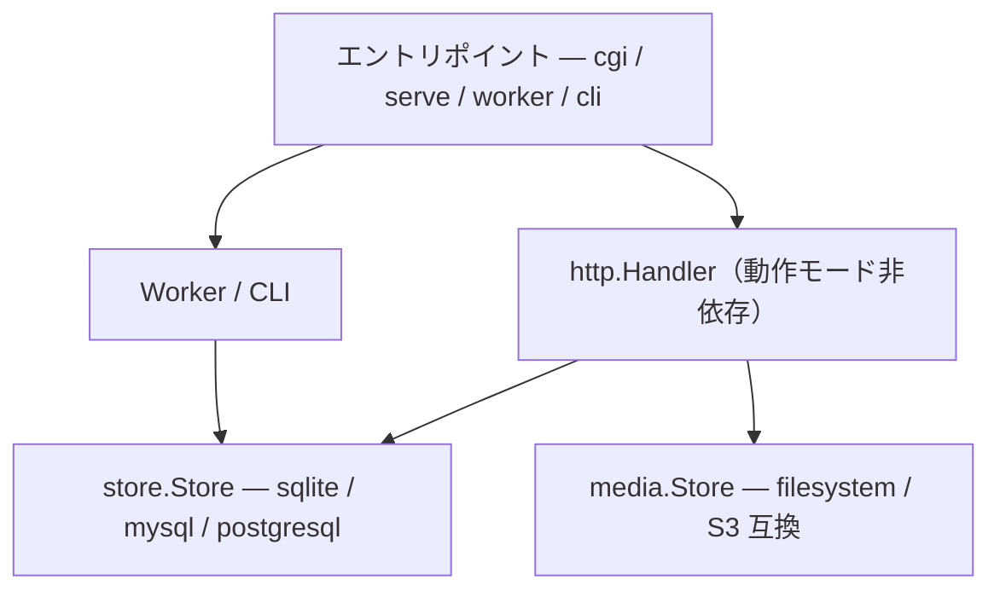

# サーバーアーキテクチャ

## 技術選定

| 要素 | 選定 | 理由 |
|------|------|------|
| 言語 | Go | シングルバイナリ、クロスコンパイル容易、CGI対応 (`net/http/cgi`) |
| DB | SQLite via [modernc.org/sqlite](https://pkg.go.dev/modernc.org/sqlite) | Pure Go実装のためcgo不要。クロスコンパイルが一発で通る |
| ActivityPub | 自前実装 | 各サーバーの方言に柔軟に対応するため、ライブラリに縛られず実装をコントロールする |
| SPA フレームワーク | [Preact](https://preactjs.com/) | React 互換で ~4KB (min+gz)。マイページ (/my/) の固定 UI に使用 |
| テンプレートエンジン | [Handlebars](https://handlebarsjs.com/) | 公開ページのテーマレンダリング。SSR + クライアントサイドハイドレーション |
| SPA ビルド | Vite | Preact 公式推奨。高速ビルド、Tree-shaking でバンドル最小化 |

## 全体構成

```
[Go サーバー]
  ├─ 公開ページ SSR (OGP + 本文 + SPA script)
  ├─ murlog 独自 API /api/mur/v1/    … SPA が使用
  ├─ ActivityPub
  └─ ジョブキュー

[SPA (静的ファイル、Go バイナリに含まない)]
  ├─ 公開ページ (Handlebars テーマ)
  └─ マイページ /my/ (Preact 固定 UI)
```

## アーキテクチャ



## 動作モード

| サブコマンド | 用途 | 想定環境 |
|--------|----------|----------|
| `murlog cgi` | CGI ハンドラとして動作 | レンタルサーバー |
| `murlog serve` | 常駐 HTTP サーバー | VPS / Docker / 自宅鯖 |
| `murlog worker` | ジョブキュー単発処理 | cron が使える環境 |
| `murlog reset` | パスワードリセットファイル生成 | パスワード忘れ時 |
| `murlog update` | GitHub Releases から自己更新 | どこでも |

全モード同一バイナリ。初期セットアップは Web UI から行うため `init` サブコマンドは設けない。

## 設定管理

起動に必要な設定はTOMLファイル、アプリケーション設定はDBに格納。

| 保存先 | 内容 | 理由 |
|--------|------|------|
| `murlog.toml` | DB 接続情報 (`db_driver`, `data_dir`)、`media_path`、`web_dir`、`listen` | DB に接続する前に必要な情報。セットアップ Step 1 で生成 |
| DB `settings` テーブル | `domain`、`password_hash`、`setup_complete`、`last_password_reset_at` 等 | バックアップ時に DB ファイル1つで完結させるため |

### murlog.toml（起動時設定）

DB 接続情報とランタイム設定のみ。

```toml
db_driver = "sqlite"
data_dir = "./data"
media_path = "./media"
web_dir = "./web/dist"

# スタンドアロンモード時のみ
listen = ":8080"
```

セットアップ Step 1 で自動生成される。手動作成も可（その場合 Step 1 はスキップ）。

### DB settings テーブル（アプリケーション設定）

- ドメイン名 (`domain`)
- パスワードハッシュ (`password_hash`)
- セットアップ完了フラグ (`setup_complete`)
- パスワード最終リセット日時 (`last_password_reset_at`)
- ペルソナ情報（ユーザー名、表示名、鍵ペア等）は personas テーブル
- API トークンは api_tokens テーブル
- マイページから変更する設定全般

## 初期セットアップ

設定ファイルも DB も存在しない状態から起動できる。WordPress のインストールウィザードと同様の 2 段階構成。

**Step 1: サーバー設定** (`/admin/setup/server`)
- `murlog.toml` が存在しない場合に表示
- DB パス、メディアパスを入力 → `murlog.toml` を生成
- 手動で `murlog.toml` を作成した場合はスキップされる

**Step 2: サイトセットアップ** (`/admin/setup`)
- `murlog.toml` が存在し、DB の `setup_complete` が未設定の場合に表示
- ドメイン名（`Host` ヘッダーから自動入力）、ペルソナ作成、パスワード設定
- Migrate → ペルソナ作成 → パスワード保存 → `setup_complete = true`

**setup guard**: 全リクエストの先頭でフェーズ判定し、未完了なら適切なステップにリダイレクト。`/admin/` パスはガードを通過する。

**セキュリティ**: 起動時に `.htaccess` の存在を確認し、なければ自動生成。`.toml`・`.db`・`.reset` ファイルへのブラウザアクセスをブロックする `FilesMatch` ルールを含む。

## DB マイグレーション

起動ごとに自動実行。冪等で、未適用分のみ差分適用される。

- `schema_version` テーブルで適用済みバージョンを管理
- マイグレーション SQL は `store/sqlite/migrations/NNN_description.sql` の命名規則で配置
- `//go:embed` でバイナリに埋め込み、ファイル名からバージョン番号をパースして順番に実行
- 適用済み (`version <= current`) はスキップ
- ユーザーに手動オペレーションを要求しない（自己更新後もバイナリ差し替え → 再起動で完了）

## ジョブキュー・ワーカー

HTTP リクエスト契機でワーカープロセスを spawn し、バックグラウンドデーモンなしで非同期処理を実現する。
SQLite の `queue_jobs` テーブルに一元化し、`Claim` の `UPDATE ... RETURNING` で排他制御する。
CGI / serve / cron のどの環境でも同一キューを共有する。

### 動作モード

| モード | トリガー | 並列度 | 環境 |
|--------|----------|--------|------|
| **CGI spawn** | リクエスト完了後に `spawnWorker()` | バッチ内並列（アダプティブ） | レンタルサーバー |
| **cron** | `murlog worker --once` | バッチ内並列（アダプティブ） | cron が使える環境 |
| **常駐** | `murlog worker` or `murlog serve` | ポーリング + 並列（アダプティブ） | VPS / Docker |
| **SPA tick** | `queue.tick` RPC (5秒間隔) | no-op（CGI リクエスト発生 → spawn トリガー） | SPA キュー管理画面 |

SPA の `queue.tick` は処理を行わず、CGI リクエストを発生させることで `spawnWorker()` のトリガーとして機能する。
serve モードでは `Run()` が常駐しているため、tick は実質不要（互換性のために残している）。

### CGI spawn — 中寿命ワーカー

CGI モードでは、リクエスト処理後に pending ジョブがあればワーカープロセスを spawn する。
ワーカーはキューが空になるか生存時間上限 (5分) に達するまでループし、自己終了する。

```
CGI request → レスポンス返却 → spawnWorker()
  └─ worker --once (flock 取得)
       └─ loop {
            RunBatch(20件, 30秒)
            if 空 or 5分経過 → break
          }
       └─ exit
```

- **flock 排他制御**: `worker.lock` ファイルに `LOCK_EX|LOCK_NB` で non-blocking ロック。別の worker が稼働中なら即終了
- **nproc +1**: 同時に動く worker は常に最大1プロセス
- **ハードリミット**: 5分 (`workerMaxLifetime`)。レンサバのプロセス監視回避用。I/O wait 主体の配送ジョブでは通常到達しない
- **fork+exec 1回のみ**: チェーン spawn と異なり app 再初期化が不要で CPU コストが低い

### アダプティブ並列度

`RunBatch` / `Run` 内で pending 数に応じて並列度を自動スケールする。
ジョブのボトルネックは外部 HTTP 配送（I/O バウンド）のため、並列化の効果が大きい。
`Run()` では10件ごとに再評価し、fan-out バーストを検知してスケールアップする。

| pending 数 | 並列度 |
|-----------|--------|
| < 100 | 8 (デフォルト min) |
| < 500 | 20 (mid) |
| >= 500 | 32 (デフォルト max) |

goroutine ベースのため並列度を上げてもリソースコストはほぼゼロ（1 goroutine ≈ 4KB）。
Mastodon (Sidekiq) のデフォルト 5、GoToSocial のデフォルト 8 と比較して、一人用サーバーとして妥当な範囲。

`murlog.toml` で min/max をカスタマイズ可能:

```toml
worker_min_concurrency = 8    # デフォルト 8
worker_max_concurrency = 32   # デフォルト 32
```

環境変数 `MURLOG_WORKER_MIN_CONCURRENCY` / `MURLOG_WORKER_MAX_CONCURRENCY` でも上書き可能。

### fan-out バッチ enqueue

`deliver_post` 等の fan-out ジョブは、フォロワー数分の子ジョブを生成する。
`fanoutToFollowers` が 100件/ページでフォロワーを走査し、`EnqueueBatch` で1トランザクションにまとめて INSERT する。

### リトライ・エラーハンドリング

- **最大リトライ**: 5回 (`MaxAttempts`)
- **指数バックオフ**: 30s → 2m → 8m → 32m
- **ジョブタイムアウト**: 60s/ジョブ (`JobTimeout`)
- **stale ジョブ回復**: 5分以上 running のジョブを failed にリセット（CGI タイムアウトやクラッシュ対策）
- **panic recover**: goroutine 内で panic しても `recover()` でキャッチし、ジョブを fail にしてループを継続。serve プロセス全体が死なない

### ドメイン別サーキットブレーカー

配送先サーバーが死んでいる場合の無駄なリトライを防止する。

- **失敗記録**: 配送失敗時に `domain_failures` テーブルのカウントをインクリメント
- **成功リセット**: 配送成功時にカウントをリセット（サーバー復活を検知）
- **dead 判定**: `failure_count >= 10` かつ `last_failure_at` が直近1時間以内
- **スキップ**: `fanoutToFollowers` で dead ドメインのフォロワーへのジョブ生成をスキップ
- dead ドメインのキャッシュは fan-out ごとにメモリ内で保持（同一 fan-out 内の重複 DB クエリを回避）

### ジョブ種別

| ジョブタイプ | 動作 | fan-out |
|------------|------|---------|
| `deliver_post` | フォロワーに deliver_note をバッチ enqueue | ○ |
| `deliver_note` | 1フォロワーへ Create Note を HTTP 配送 | |
| `deliver_update` | 1フォロワーへ Update Actor を HTTP 配送 | |
| `deliver_delete` | フォロワーに deliver_delete_note をバッチ enqueue | ○ |
| `deliver_delete_note` | 1フォロワーへ Delete を HTTP 配送 | |
| `deliver_announce` | 1アクターへ Announce/Undo を HTTP 配送 | |
| `accept_follow` | Follow リクエストに Accept を HTTP 配送 | |
| `reject_follow` | Follow リクエストに Reject を HTTP 配送 | |
| `send_follow` | Follow Activity を HTTP 配送 | |
| `send_undo_follow` | Undo Follow を HTTP 配送 | |
| `send_like` | Like Activity を HTTP 配送 | |
| `send_undo_like` | Undo Like を HTTP 配送 | |
| `send_announce` | フォロワーに deliver_announce をバッチ enqueue | ○ |
| `send_undo_announce` | フォロワーに deliver_announce (Undo) をバッチ enqueue | ○ |
| `send_block` | Block Activity を HTTP 配送 | |
| `send_undo_block` | Undo Block を HTTP 配送 | |
| `update_actor` | フォロワーに deliver_update をバッチ enqueue | ○ |

## メディアストレージ

アバター画像・添付ファイル等の保存先。DBストレージと同様にInterface化し差し替え可能にする。

| バックエンド | 想定環境 | 備考 |
|-------------|----------|------|
| ファイルシステム | レンタルサーバー / VPS | デフォルト |
| S3互換 | VPS / クラウド | Cloudflare R2 等。AWS SigV4 自前実装、外部依存ゼロ |
